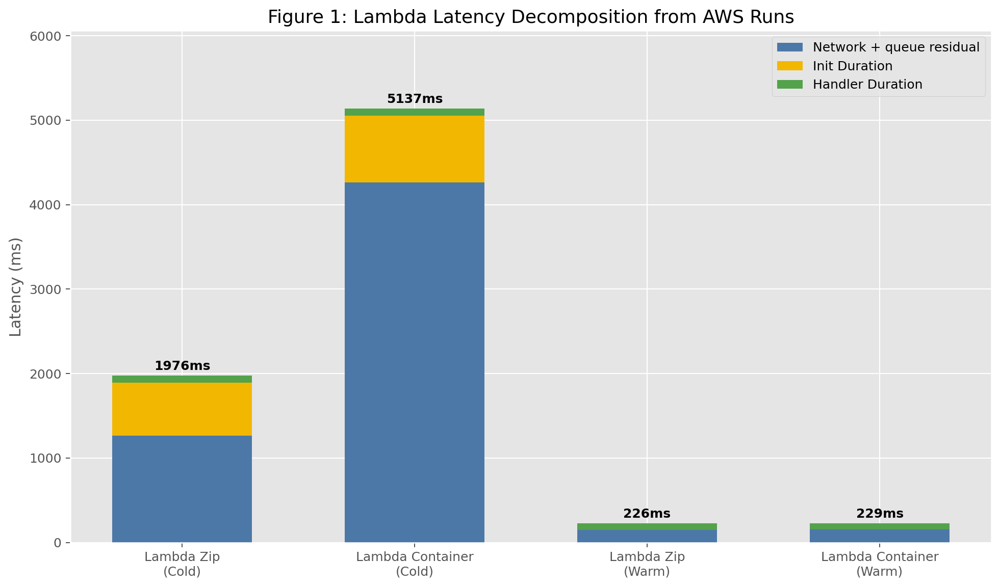
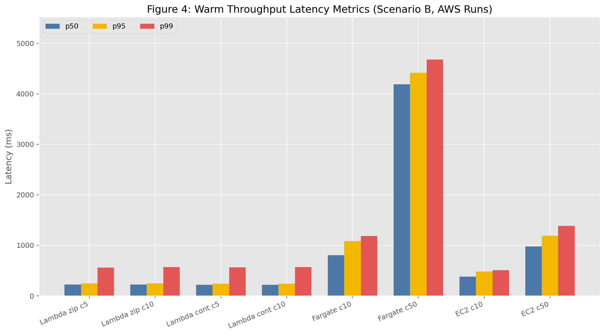
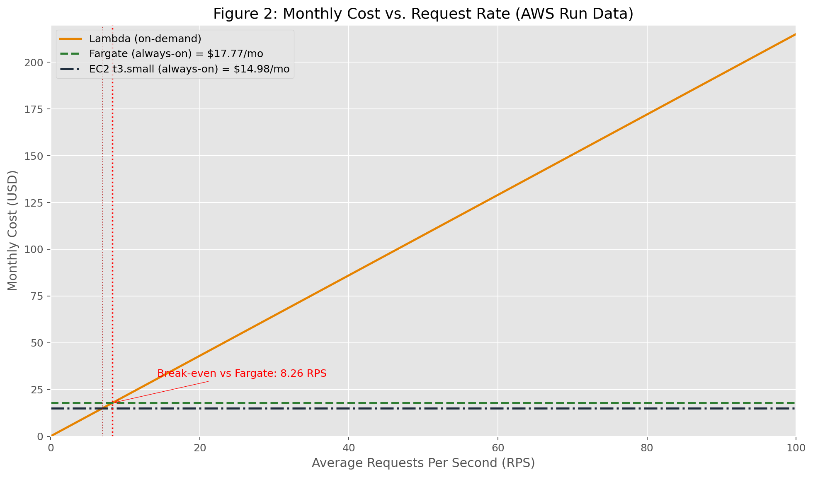
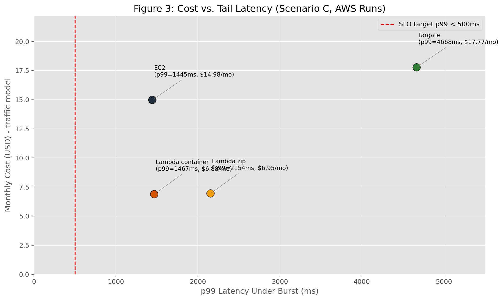

# AWS Cloud Lab Report

## Setup Summary (Assignment 1)
Four targets were deployed and exercised:
- Lambda (zip)
- Lambda (container)
- ECS Fargate (ALB)
- EC2 (t3.small)

All scenario outputs in `results/scenario-*.txt` show `Success rate: 100.00%` with HTTP 200 responses, which verifies endpoint functionality during the experiment window.

## Assignment 2: Scenario A - Cold Start Characterization

### Client-side latency (30 sequential requests, 1 req/s)
| Target | p50 (ms) | p95 (ms) | p99 (ms) | max (ms) |
|---|---:|---:|---:|---:|
| Lambda zip | 225.8 | 291.6 | 1976.4 | 1976.4 |
| Lambda container | 228.9 | 282.2 | 5136.8 | 5136.8 |

### CloudWatch decomposition (from REPORT lines)
| Metric | Lambda zip | Lambda container |
|---|---:|---:|
| Cold starts observed (`Init Duration`) | 22 | 20 |
| Avg cold init (ms) | 629.95 | 789.45 |
| Avg cold handler duration (ms) | 83.76 | 80.83 |
| Warm handler p50 (ms) | 75.58 | 74.65 |

### Latency decomposition estimates
Using:
- warm: $RTT = total - Duration$
- cold: $RTT = total - Init - Duration$

Estimated components:
- Zip cold total (p99): 1976.4 ms
  - Init: 629.95 ms
  - Handler: 83.76 ms
  - Network+queue residual: 1262.69 ms
- Container cold total (p99): 5136.8 ms
  - Init: 789.45 ms
  - Handler: 80.83 ms
  - Network+queue residual: 4266.52 ms
- Warm invocation total (approx p50): 225.8 ms (zip), 228.9 ms (container)
  - Handler: ~75 ms
  - Network+queue residual: ~150 ms

Interpretation:
- Zip cold starts were faster than container cold starts in this run.
- Container had larger tail behavior (single very high cold start, max 5.14 s).
- Handler time is small and similar between variants; cold-init and external overhead dominate tails.

## Assignment 3: Scenario B - Warm Throughput

| Environment | Concurrency | p50 (ms) | p95 (ms) | p99 (ms) | Server avg (ms) |
|---|---:|---:|---:|---:|---:|
| Lambda (zip) | 5 | 222.3 | 243.2 | 558.8 | 77.0* |
| Lambda (zip) | 10 | 222.3 | 245.6 | 567.6 | 77.0* |
| Lambda (container) | 5 | 219.9 | 241.1 | 562.2 | 75.5* |
| Lambda (container) | 10 | 219.6 | 241.3 | 567.7 | 75.5* |
| Fargate | 10 | 806.3 | 1082.2 | 1184.7 | N/A** |
| Fargate | 50 | 4187.4 | 4418.4 | 4679.2 | N/A** |
| EC2 | 10 | 378.3 | 481.1 | 508.1 | N/A** |
| EC2 | 50 | 978.4 | 1191.9 | 1383.8 | N/A** |

Notes:
- *Lambda server averages are from CloudWatch warm handler durations (not client RTT).
- **Fargate/EC2 response-body `query_time_ms` samples were not preserved in artifacts.

Tail-instability check (`p99 > 2 x p95`):
- Lambda zip c5: yes (558.8 > 486.4)
- Lambda zip c10: yes (567.6 > 491.3)
- Lambda container c5: yes (562.2 > 482.2)
- Lambda container c10: yes (567.7 > 482.6)
- Fargate and EC2 runs: no

Interpretation:
- Lambda p50 is almost unchanged between c=5 and c=10 because requests fan out over multiple execution environments.
- Fargate/EC2 p50 rises sharply at c=50 due to queueing on a single running task/instance.
- Client p50 exceeds server handler time due to TLS/network RTT, ALB path (for Fargate), SigV4/Lambda URL overhead, and queueing.

## Assignment 4: Scenario C - Burst From Zero

| Environment | p50 (ms) | p95 (ms) | p99 (ms) | max (ms) |
|---|---:|---:|---:|---:|
| Lambda zip | 223.4 | 1755.1 | 2154.3 | 2164.0 |
| Lambda container | 224.0 | 1354.6 | 1467.3 | 1482.6 |
| Fargate | 4106.7 | 4508.3 | 4667.9 | 4757.2 |
| EC2 | 951.2 | 1288.9 | 1444.9 | 1522.5 |

Observed Lambda cold-start counts in exported CloudWatch reports:
- Zip: 22 cold starts
- Container: 20 cold starts

Interpretation:
- Lambda latency is bimodal under burst: warm cluster near ~220 ms and cold-start cluster above 1.3-2.2 s.
- As deployed, none of the environments meets p99 < 500 ms under this burst scenario.

## Assignment 5: Cost at Zero Load
Using us-east-1 public pricing (rates used in calculations):
- Lambda: request + GB-second only (no idle infrastructure charge)
- Fargate (0.5 vCPU, 1 GB):
  - vCPU: $0.04048 / vCPU-hour
  - memory: $0.004445 / GB-hour
  - total hourly: $0.024685
- EC2 t3.small: $0.0208 / hour

Idle cost (0 RPS):
- Lambda: $0.00/hour, $0.00/month
- Fargate: $0.024685/hour, $17.7732/month
- EC2: $0.0208/hour, $14.9760/month

(Always-on monthly assumes $24 \times 30 = 720$ hours.)

## Assignment 6: Cost Model, Break-Even, Recommendation

Traffic model:
- Peak: 100 RPS for 30 min/day
- Normal: 5 RPS for 5.5 h/day
- Idle: 18 h/day

Requests:
- Daily: $100 \cdot 1800 + 5 \cdot 19800 = 279000$
- Monthly: $279000 \cdot 30 = 8{,}370{,}000$

Lambda monthly cost formula:
$$
C_\lambda = N\cdot\frac{0.20}{10^6} + N\cdot d\cdot m\cdot 0.0000166667
$$
Where:
- $N = 8{,}370{,}000$ requests/month
- $d = 0.07558$ s (warm p50 handler, zip)
- $m = 0.5$ GB

Computed Lambda cost:
- Request charge: $1.6740$
- Compute charge: $5.2717$
- Total: **$6.9457 / month**

Always-on monthly costs:
- Fargate: **$17.7732 / month**
- EC2: **$14.9760 / month**

### Break-even RPS (Lambda vs Fargate)
Per-request Lambda coefficient:
$$
k = \frac{0.20}{10^6} + d\cdot m\cdot 0.0000166667 = 8.2987\times10^{-7}
$$
Break-even monthly requests vs Fargate:
$$
N_{be} = \frac{17.7732}{k} = 21{,}417{,}762
$$
Convert to RPS:
$$
RPS_{be} = \frac{N_{be}}{30\cdot24\cdot3600} = 8.26
$$

Additional reference (Lambda vs EC2):
- Break-even at ~6.96 RPS average.

### Recommendation
For the given traffic model (average 3.23 RPS), **Lambda is the lowest-cost option** by a large margin.

However, with current configuration, the p99 < 500 ms SLO is not met under burst (Scenario C) and is also exceeded in warm Scenario B tails (~560-570 ms p99).

Recommended deployment decision:
- Choose Lambda only if you add latency controls (Provisioned Concurrency and/or keep-warm strategy, plus memory tuning and possibly reserved concurrency strategy).
- If strict p99 < 500 ms must hold immediately with minimal tuning effort, use EC2 with scaling improvements (or a multi-task Fargate service with auto-scaling), accepting higher steady cost.

When recommendation changes:
- If average load rises above ~8.26 RPS, Lambda cost approaches/exceeds Fargate baseline.
- If SLO is relaxed (e.g., p99 < 1.5 s), current Lambda container burst behavior may become acceptable.

### Embedded cost and trade-off figures

## Reproducibility Artifacts Checklist
Present:
- Scenario A/B/C oha outputs
- CloudWatch REPORT exports for both Lambda variants
- Core figures (`fig1`..`fig4`)
- This report

Pricing values used in this report are explicitly listed in Assignment 5 and were applied consistently in Assignment 6 calculations.
